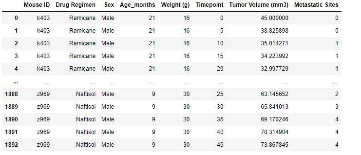

# Matplotlib-Challenge

In this challenge I am a data analyst for the pharmaceutical company known as Pymaceuticals Inc. I will be working with some of their most recient animal studies, which is anti-cancer treatment on mices. This study consisted of 249 mices that has SCC tumor growth, these mices were divided into different group and given a different drugs regiment. Over the course of 45 days they were observed and measured. 

### Tools
The data was located in the "data" folder, The tools I used is Python, and mainly working in Jupyter notebook. The tools within Jupyter notebook that I used is; matplotlib.pyplot, pandas, scipy.stats, and numpy.

### Steps
The data that we received came in 2 csv files: "mouse_metadata_path", and "study_results_path." Because of this I needed to combine both datasets, which was easily done because both datasets used the “Mouse ID” to identify each specimen. Here is an example of what the new dataset looked like: 

----

----

### Data
