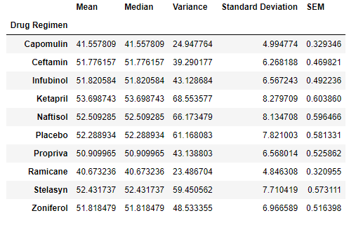

# Matplotlib-Challenge

In this challenge I am a data analyst for the pharmaceutical company known as Pymaceuticals Inc. I will be working with some of their most recient animal studies, which is anti-cancer treatment on mices. This study consisted of 249 mices that has SCC tumor growth, these mices were divided into different group and given a different drugs regiment. Over the course of 45 days they were observed and measured. 

### Tools
The data was located in the "data" folder, The tools I used is Python, and mainly working in Jupyter notebook. The tools within Jupyter notebook that I used is; matplotlib.pyplot, pandas, scipy.stats, and numpy.

### Data
The data that we received came in 2 csv files: "mouse_metadata_path", and "study_results_path." Because of this I needed to combine both datasets, which was easily done because both datasets used the “Mouse ID” to identify each specimen. Here is an example of what the new dataset looked like: 

---
Since combining the two datasets created something of a mess, I had to check to make sure that there were still 249 mices in the overall experiment. I then also dropped any unnecessary duplicates. Now that everything is cleaned up I created a summary statistics table as shown below: 

---
With what I have found I created a few graphs to show the mice distribution:

---

Moving along now, I want to focus on 4 different Drug Regimnent; Capomulin, Ramicane, Infubino and Ceftamin. Focusing on these 4 I will need to find the first and third quartile, the IQR, and the lower and upper bounds of the final tumor volume for each drug regiment. Once I have found these I will be able to create a box and wisker plot, so that I can show what the range of the final tumor volume is, and to see if there are any outliers. Below shows a combination of all four graphs and any potential outliers.

### TBC
